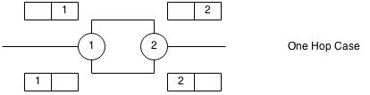
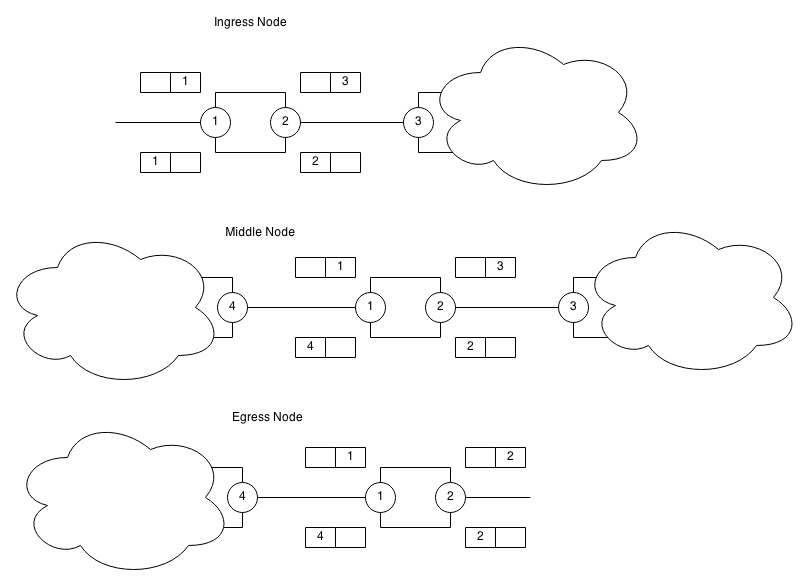

Label/Tag Allocation Tutorial
====================

This tutorial explains the allocation and the association
of the Tag/Label hop-by-hop. The Tag/Label is always associated to
the Destination Port. However there are some special cases.

Path with One Hop
========

Path with more than One Hop
=================

